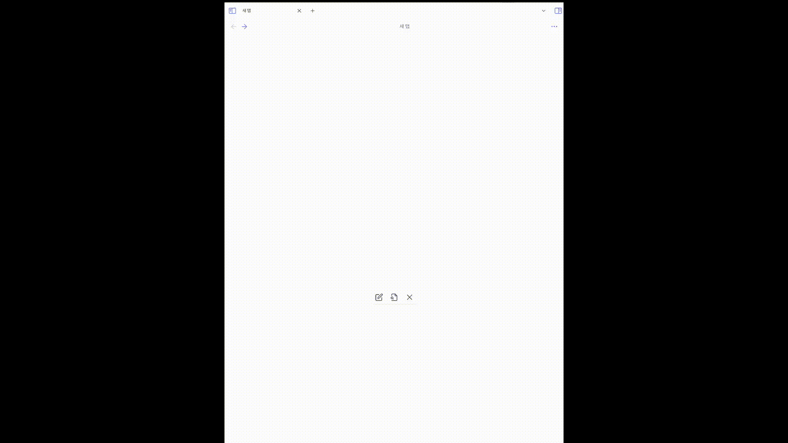
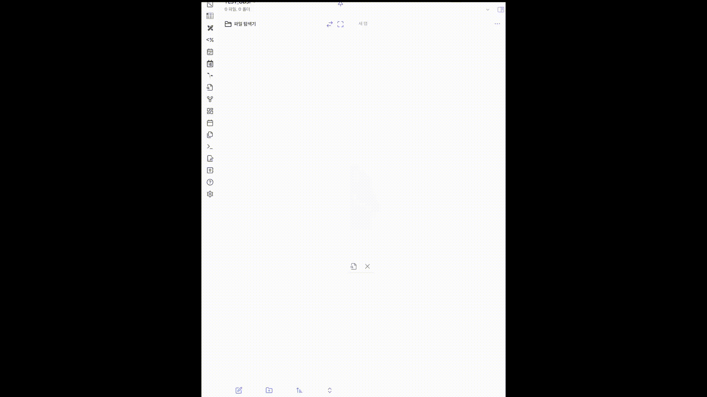
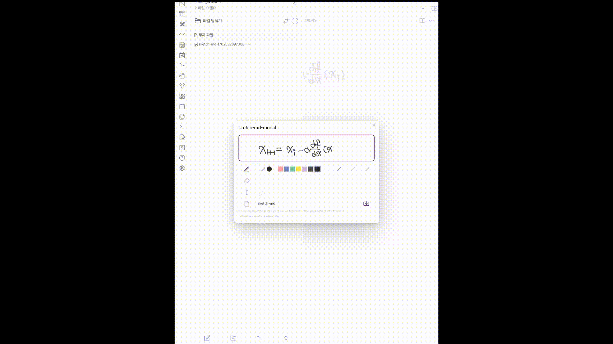

# SketchMD

## 소개 (Introduction)

-   SketchMD는 Obsidian 사용자들이 마크다운 파일 내에서 직접 그림을 그리고 스케치할 수 있게 하는 플러그인입니다.
    (SketchMD is a plugin for Obsidian that allows users to draw and sketch directly within markdown files.)

## 특징 (Features)

-   마크다운 문서 내에서 직접 그림을 그릴 수 있는 기능
    (Enables drawing directly within markdown documents)
-   Obsidian 사용자들에게 향상된 노트 작성 경험 제공
    (Provides enhanced note-taking experience for Obsidian users)

## 설치 방법 (Installation)

-   Obsidian 최신 버전 설치
    (Ensure you have the latest version of Obsidian installed)
-   플러그인 섹션에서 'SketchMD' 검색 및 설치
    (Search and install 'SketchMD' from the plugins section)

## 사용 방법 (Usage)

-   마크다운 파일을 열고 스케치하고 싶은 부분에 그림 도구 사용합니다.
    (Open a markdown file and use the drawing tools on the section you want to sketch.)

-   주의! 마크다운 파일이 열려 있지 않으면 그림 도구를 사용할 수 없습니다.
    (Caution! The drawing tools cannot be used unless a markdown file is open.)
    

-   다양한 그리기 옵션을 활용할 수 있으며, 창을 닫기 전에 높이를 조절하면서 여러 번 저장할 수 있습니다.
    (You can use various drawing options and save multiple times by adjusting the height before closing the window.)
    

-   추가된 이미지 파일은 루트 파일 아래에 저장됩니다.
    (Added image files are saved under the root file.)

-   이미지 파일의 이름은 '지정된 파일이름-(date).png' 형식으로 저장됩니다.
    (The image files are saved with the format 'specified filename-(date).png.')

## 주의 사항 (Cautions)

-   모바일 기기 지원은 아이패드에서만 가능합니다.
    (Mobile device support is available only on iPads.)
-   현재 버전 1.0.0에서는 이벤트 반응 속도가 다소 느릴 수 있습니다.
    (Event response might be slow in the current version 1.0.0.)
-   글씨를 쓸 때는 천천히 써 주시길 바랍니다.
    (Please write slowly when using the drawing tools.)

## 개발자 정보 (Developer Information)

-   개발자: darae
    (Developer: darae)
-   GitHub 페이지
    [GitHub Page](https://github.com/DaRae-00)
-   후원 링크
    [Funding Link](https://www.buymeacoffee.com/jibsun.i)
